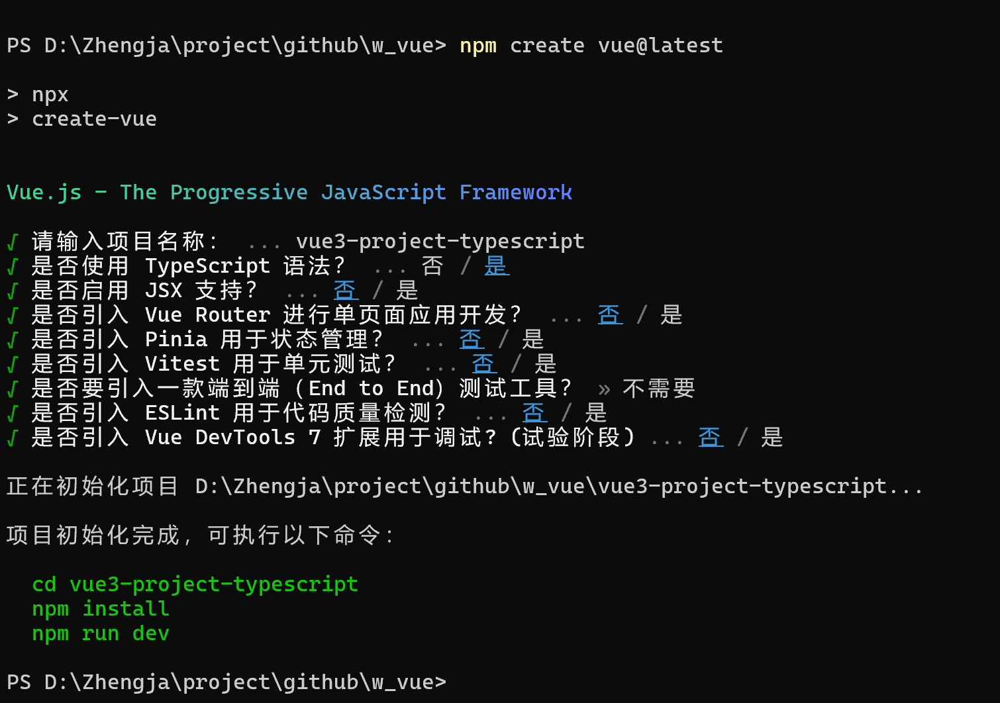

# vue3-project-typescript

This template should help get you started developing with Vue 3 in Vite.

## Recommended IDE Setup

[VSCode](https://code.visualstudio.com/) + [Volar](https://marketplace.visualstudio.com/items?itemName=Vue.volar) (and disable Vetur).

## Type Support for `.vue` Imports in TS

TypeScript cannot handle type information for `.vue` imports by default, so we replace the `tsc` CLI with `vue-tsc` for type checking. In editors, we need [Volar](https://marketplace.visualstudio.com/items?itemName=Vue.volar) to make the TypeScript language service aware of `.vue` types.

## Customize configuration

See [Vite Configuration Reference](https://vite.dev/config/).

## Project Setup

```sh
npm install
```

### Compile and Hot-Reload for Development

```sh
npm run dev
```

### Type-Check, Compile and Minify for Production

```sh
npm run build
```

## 项目创建：

```
npm create vue@latest
```



## TypeScript 支持

选择是否使用 lang="ts" 主要取决于项目类型：

* 快速原型开发 → 纯 JavaScript
* 长期维护项目 → TypeScript
* 团队协作项目 → 强制 TypeScript

